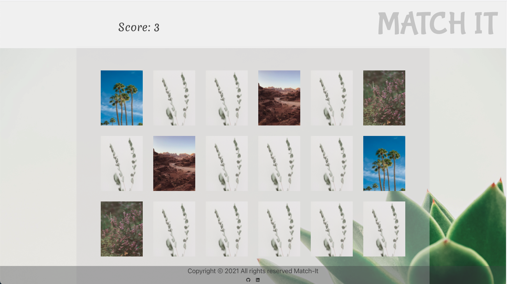

# MATCH IT!

### A simple matching game that takes you back to vanilla Javascript!  

## TECHNOLOGIES USED

- HTML5

- JavaScript(ES6)

- CSS/ Transitions

- Bulma 

## WIREFRAME

## SCREENSHOTS

## GETTING STARTED
[click here](https://match-it-game.netlify.app) to view deployed app

## Future Updates
- complete timer function
- add score board that shows the high scores of each player 
- make animations smother

